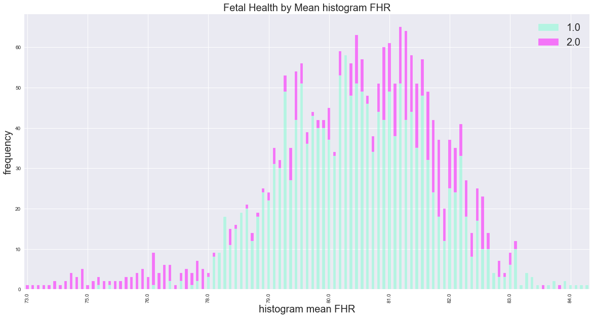
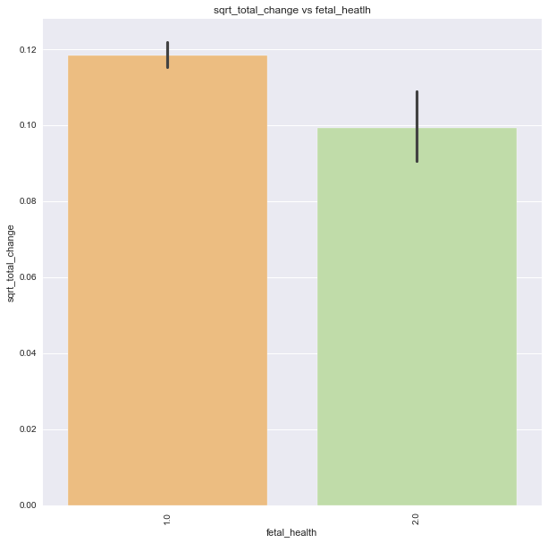
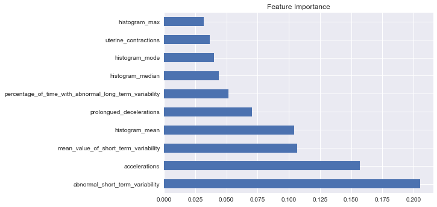

# Phase_3_Project


# Predicting Fetal Risk Using Cardiotocographic Data

**Authors**: Jacob Heyman, Ismael Araujo

## Overview
As medical technology advances, the rate of preventable child mortality decreases. Lowering child mortality rates has become a key goal in advancing any society and a key in human progress as a whole. While there are many advnacments that have improved the mortality rate, not all of these practices are globaly available. In order to improve mortality rates in cost effective and readily available solutions need to be applied and perfected.

One such cost effective and relativly simple method would be the use of Cardiotocograms (CTG). The CTG is a non-invasive fetal moniter which is used to asses fetal health. The CTG is used to detect fetal heart rate(FHR), uterin contractions, fetal movement, and sudden changes in heart rate. Extreme changes to the FHR results in surgical intervention through the use of cesarian delivery(C-section). Currently, doctors rely on a visual analyisis of the CTG leading to erroneous interpretations of the exam. Minute changes which may be extremely detrimental to fetal health may also not be visable to the naked eye. Conversley some observable changes in fetal heart rate may appear to be fetal distress, but are just a response to other factors like uterine contractions. Opting to preform a C-section increases the chances of mortality not only for the child but also the the mother. For these reasons visual analysis of a CTG exam is limited by human error and cannot diffinitavly detect fetal distress.

In order to improve diagnosis of fetal distress with a CTG and improve the mortality rate, the use of machine learning algorithms becomes a viable option. A well trained model will be able to identify which variable changes to the FHR have the greatest effect on fetal health. To lower the overal risk of child mortality a ML model must not only be able to accuratly classify between normal and distressed fetal health, but be precise enough in its predictions to prevent any unecessary interventive surgical procedures.

For our analysis of the we used a CTG exam dataset found on Kaggle from The Journal of Maternal-Fetal Medicine. The dataset consisted of 2126 CTG exam records which were classified into three classes(normal,suspect,pathological). In this initial analysis we decided to create a binary class of normal and distressed, combining the suspect and pathological classes into one class.

To address the issue of eliminating human error and erroneous surgical intervention, our goal of this analysis was to identify which key features played a role in determining the healthy or distressed classes, and to produce a highly precise model to eliminate unecessary C-sections. To acheive these goals, we preformed an extensive exploritory data analysis, created baseline models and preformed hyperparameter tuning of models for both an experimental feature and unaltered CTG data set. Our final model had clear feature importance and the best evaluation metrics


## Business Problem
Preventing child mortality is a key indicator of medical progress.  A large precentage of deaths are the result of low access to resources that moniter fetal health.  One cost effective solution to moniter fetal health is the use of Cardiotocograms(CTGs). CTGs moniter fetal heart rate, fetal movement, uterine contractions, suddon heart rate changes and many other health metrics.  CTG scans are currently interpreted via visual analysis by the physician, and eroneous errors may result in increase fetal health risk.  Using a kaggle database of collected CTG exams, we aim to identify which features have the most impact on fetal health being either normal or distressed.  Using these features, we also aim to tune a model that provides the best predictions of fetal health class.  To identrify the key features and create a precise model we considered the following **research questions:** 
**- What feature have the greatest influence on the model**
**- What, if any, new features affect the model**
**- Which model makes the best predictions of fetal health class, and has the most precise predictions.** 


## Data
Our data came from Kaggle.com (https://www.kaggle.com/andrewmvd/fetal-health-classification).  The data comes from 2126 cardiotocogram measurments described in Ayres de Campos et al. (2000) SisPorto 2.0 A Program for Automated Analysis of Cardiotocograms. J Matern Fetal Med 5:311-318.  The CTG measurments where used to create a classification model to classify fetal health being either normal or distressed.  The DataFrame included the following columns:

- **baseline_value - Baseline Fetal Heart Rate**
- **accelerations - Number of accelerations per second**
- **fetal_movement - Number of fetal movements per second**
- **uterine_contractions - Number of uterine contractions per second**
- **light_decelerations - Number of LDs per second**
- **severe_deceleration - Number of Sds per second**
- **prolongued_deceleration - Number of PDs per second**
- **abnormal_short_term_variatability - Percentage of time with abnormal short tearm variatability**
- **mean_value_of_short_term_variability - Mean value of short term variability**
- **percentage_of_time_with_abnormal_long_term_variability - Percentage of time with abnormal long term variability**
- **mean_value_of_long_term_variability - average value of long tearm variability**
- **histogram_width - Width of histogram using all the values from the record**
- **histogram_min - minimum value of histogram**
- **histogram_max - maximum value of hitogram**
- **histogram_number_of_peaks - number of peaks in the exam histogram**
- **histogram_number_of_zeroes - number of zeros in the exam histogram**
- **histogram_mode - histogram mode**
- **histogram_mean - histogram mean**
- **histogram_median - histogram median**
- **histogram_variance - histogram variance**
- **histogram_tendency - histogram tendancy**
- **fetal_health - 0: normal 1:distressed**


## Methods
To determine the key features in fetal health classification and produce the best possible model, we implemented the following methods in our analysis
- Initial Data Analysis and Data cleaning
    - changed target class label into binary fetal health class (normal: 1, distressed: 2)
- EDA
    - In depth analysis of features and relations with other features and the target class
    
- Baseline models
    - default models(KNN, Logistic Regression, Decision Tree, and Random Forest)
- Feature Engineering
- Created two modeling process notebooks Vanilla and Experimental
    - to compare unaltered dataset model tuning to experimental feature dataset
- modeling and hyperparameter tuning for both databases
    - KNN
    - Logistic Regression
        - Bagging classifer 
    - Decision Tree
    - Random Forest
        - GridSearch
        - Model with best parameteres
    - XGBoost
        - Gridsearch
        - Model with best parameters
    
- checked feature importance of best models


## Results
In our exploritory analysis we preformed several baseline models to see how the dataset classifed fetal health.  Each baseline model was surprisingly accurate at predicting the classes.  We decided to preform two seperate modeling processes focusing on tuning the hyperparameters on the untouched dataset(vanilla) and an experimental dataset with new features.  For the experimental dataset we created several new features, using binning, dummy variables and a combination of several existing features.


The best model overall for vanilla was a grid search random forest with the following hyperparameters and evaluation metrics:
    
   - **Best Parameters:** {'criterion': 'entropy', 'max_depth': 10, 'max_features': 10, 'n_estimators': 50, 'oob_score': False}
   - **Evaluation Metrics** 
       - **Accuracy:** 0.9605263157894737
       - **Recall:** 0.9755501222493888
       - **F1 Score:** 0.9743589743589743
       - **Precision:** 0.973170731707317
   - **Top 10 Features**
       - 


- What features are the biggest factors in fetal health classification
- What our best model was:
    - vanilla: grid search random forest
    - grid search xgboost
- Which features attributed to out best model
    - abnormal_short_term_variatability
    - histogram mode
    - histogram mean
    - histogram width
    - histogram min


## Conclusions
- Our best models
    - grid search xg boost
    - best model for the vinella was grid search random forest
- What features most influenced our best model
    - abnormal_short_term_variatability
    - histogram mode
    - histogram mean
    - histogram width
    - histogram min
- the xg boost gridsearch was the overall best model
    - lowest recall and the a very high precision score
- Using our model the fetal health can be more accuratly classified reducing the unnnecessary invasive surgery and the overal risk of fetal mortality.  


## Next Steps
- make a multiclass for fetal health, multiple classes of fetal health to better classify the health state
- find more ctg exam data to better train model.  This data set did not have a lot of instances for poor fetal health
- consider maternal health and other diagnostic metrics into the model(heart rate, oxygen level, what anestetics are used)

 

## For More Information
- kaggle dataset
- ncbi papers


## Repository Structure

```
├── README.md                           <- 
├── fetal_heatlh_data_analysis          <- 
├── experimental_feature_Modeling       <- 
├──                                     <- 
├──                                     <- 
├──                                     <- 
├──                                     <- 
├──                                     <- 
└──                                     <-  
```